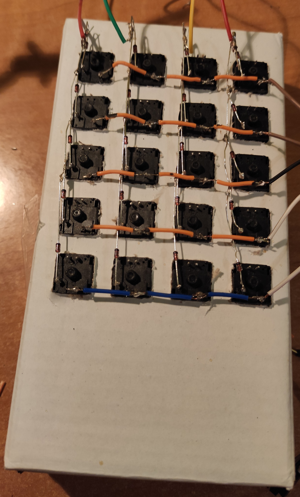

# Projekt małej klawiatury opartej na płytce rozwojowej FRDM-KL25Z

Niniejsza strona dotyczny postępów nad klawiaturą 4x5 podłączanej do płytki Freedom FRDM-KL25Z 

### HARDWARE
---

Projekt składa się z:
- Płytki Freedom FRDM-KL25Z
- 20 przełączników mechanicznych (w tym przypadku liniowe)
- 20 diod prostowniczych
- okablowanie
- pudełko stanowiące obudowę urządzenia

Przyciski, diody i seria przewodów połączeniowych została zlutowana według następującego schematu (widok od zewnętrznej strony- strony przycisków).


Fizycznie układ wygląda następująco:


### SOFTWARE

Program na platformę został napisany i skompilowany w sieciowym środowisku  [**Mbed Copiler**](https://ide.mbed.com/compiler/)

Kod źródłowy:

```c

#include "mbed.h"
#include "USBMouseKeyboard.h"
#include <string>


USBMouseKeyboard key_mouse;

DigitalIn rowA(PTC9);		//ustalanie wejść do płytki, 5 wierszy 
DigitalIn rowB(PTC8);
DigitalIn rowC(PTA5);
DigitalIn rowD(PTA4);
DigitalIn rowE(PTA12);

DigitalOut col1(PTA13);		// ustalanie wyjść z płytki, 4 kolumny
DigitalOut col2(PTD5);
DigitalOut col3(PTD0);
DigitalOut col4(PTD2);


int klaw = 1; // mode 0 - kalkulator, 1 - klawiatura T9
int jest =0;
int bylo[20] = {0,0,0,0,0,0,0,0,0,0,0,0,0,0,0,0,0,0,0,0};

// wartości dla guzików zaplanowane dla różnych trybów działania:
string T[20] = {"m","/","*","-", ".?!@#%","abc","def","([<{", "ghi","jkl","mno",")]>}", "pqrs","tuv","wxyz"," ",  "NextSignBtn","SpacebarBtn","DeleteBtn","EnterBtn"};
char znaki[20] = {'m','/','*','-', '7','8','9','+', '4','5','6','[', '1','2','3',']', 's','0',',','='};


int main(void)
{
		
    col1=1;		//zmienne ustawione na 1 dla wszystkich kolumn
    col2=1;
    col3=1;
    col4=1;
    rowA.mode(PullUp);
    rowB.mode(PullUp);
    rowC.mode(PullUp);
    rowD.mode(PullUp);
    rowE.mode(PullUp);
    
    
    
    
    while (1) 
    {
        if(klaw==1) // działanie w trybie klawiatury T9 
        {
            
            col1=0;		//ustawienie wartości 0 aby móc odczytać wartość w trybie PullUp
            if(rowA == 0) // button0
            {
                if(jest==0)
                {
                    klaw = 0;
                    jest = 1;
                }
            }
            else
                {
                 jest =0;   
                }
            
            if(rowB == 0) writeClearWrite(4); // button 4
            
            if(rowC == 0) key_mouse.keyCode(znaki[8]); // button 8
            if(rowD == 0) key_mouse.keyCode(znaki[12]); // button 12
            if(rowE == 0) key_mouse.keyCode(znaki[16]); // button 16
            col1=1;
            
            col2=0;
            if(rowA == 0) key_mouse.keyCode(znaki[1]); // button 1
            if(rowB == 0) key_mouse.keyCode(znaki[5]); // button 5
            if(rowC == 0) key_mouse.keyCode(znaki[9]); // button 9
            if(rowD == 0) key_mouse.keyCode(znaki[13]); // button 13
            if(rowE == 0) key_mouse.keyCode(znaki[17]); // button 17
            col2=1;
            
            col3=0;
            if(rowA == 0) key_mouse.keyCode(znaki[2]); // button 2
            if(rowB == 0) key_mouse.keyCode(znaki[6]); // button 6
            if(rowC == 0) key_mouse.keyCode(znaki[10]); // button 10
            if(rowD == 0) key_mouse.keyCode(znaki[14]); // button 14
            if(rowE == 0) key_mouse.keyCode(znaki[18]); // button 18
            col3=1;
            
             col4=0;
            if(rowA == 0) key_mouse.keyCode(znaki[3]); // button 3
            if(rowB == 0) key_mouse.keyCode(znaki[7],0x02); // 0x02 to modyfikator SHIFT !!! // button 7
            if(rowC == 0) key_mouse.keyCode(znaki[11]); // button 11
            if(rowD == 0) key_mouse.keyCode(znaki[15]); // button 15
            if(rowE == 0) key_mouse.keyCode(znaki[19]); // button 19
            col4=1;
        }
        
        else   //tryb kalkulatora
        {
            led = 0;
            
            col1=0;
            if(rowA == 0) 
            {
                if(jest==0)
                {
                    klaw = 1;
                    jest = 1;
                }
                
            }
            else
                {
                 jest =0;   
                }
            if(rowB == 0) key_mouse.keyCode(znaki[4]);
            if(rowC == 0) key_mouse.keyCode(znaki[8]);
            if(rowD == 0) key_mouse.keyCode(znaki[12]);
            if(rowE == 0) key_mouse.keyCode(znaki[16]);
            col1=1;
            
            col2=0;
            if(rowA == 0) key_mouse.keyCode(znaki[1]);
            if(rowB == 0) key_mouse.keyCode(znaki[5]);
            if(rowC == 0) key_mouse.keyCode(znaki[9]);
            if(rowD == 0) key_mouse.keyCode(znaki[13]);
            if(rowE == 0) key_mouse.keyCode(znaki[17]);
            col2=1;
            
            col3=0;
            if(rowA == 0) key_mouse.keyCode(znaki[2]);
            if(rowB == 0) key_mouse.keyCode(znaki[6]);
            if(rowC == 0) key_mouse.keyCode(znaki[10]);
            if(rowD == 0) key_mouse.keyCode(znaki[14]);
            if(rowE == 0) key_mouse.keyCode(znaki[18]);
            col3=1;
            
             col4=0;
            if(rowA == 0) key_mouse.keyCode(znaki[3]);
            if(rowB == 0) key_mouse.keyCode(znaki[7],0x02); // 0x02 to modyfikator SHIFT !!!
            if(rowC == 0) key_mouse.keyCode(znaki[11]);
            if(rowD == 0) key_mouse.keyCode(znaki[15]);
            if(rowE == 0) key_mouse.keyCode(znaki[19]);
            col4=1;
        }
        
        wait_ms(10);	//pętla wykonywana co 100 ms
        
    }
}
// 


```

### Obecna forma urządzenia:


